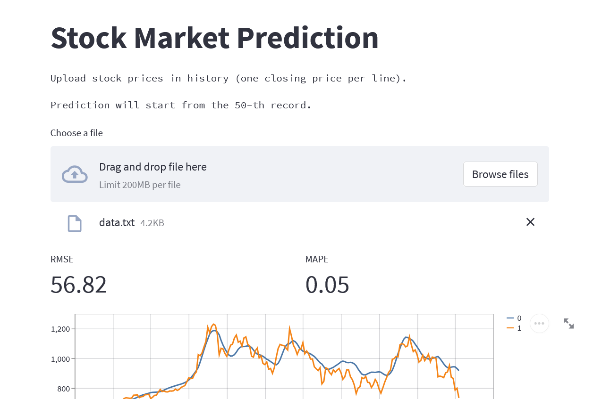

# stock-pred
Stock Prediction Demo with ML/DL



## Preparation

## MLSteam

To experiment on model training, open and run the `train_lstm.ipynb` notebook.

To experiment on model prediction, open and run the `pred_lstm.ipynb` notebook.

## Azure Machine Learning

TODO: dataset

To experiment on model training, open and run the `train_lstm_azure.ipynb` notebook.

To experiment on model prediction, open and run the `pred_lstm_azure.ipynb` notebook.

To deploy a registered model locally:

1. In the following steps:
   - `$ENDPOINT_NAME`: actual endpoint name, which should be unique in the Azure region.
   - `$DEPLOYMENT_NAME`: actual deployment name
   <!--- `$INSTANCE_TYPE`: a supported instance type as mentioned [here](https://docs.microsoft.com/en-us/azure/machine-learning/reference-managed-online-endpoints-vm-sku-list).-->
1. Edit `azure_yml/endpoint.yml`: replace the value of `name` by `$ENDPOINT_NAME` (expanded).
1. Edit `azure_yml/blue-deployment.yml`: replace the value of `endpoint_name` by `$DEPLOYMENT_NAME` (expanded)<!-- and replace the value of `instance_type` (expanded)-->.
1. In Azure terminal:
   ```bash
   az ml online-endpoint create --local -n $ENDPOINT_NAME -f azure_yml/endpoint.yml
   az ml online-deployment create --local -n blue -e $ENDPOINT_NAME -f azure_yml/blue-deployment.yml
   ```

To send a request to the deployed model:

1. In Azure terminal with Azure CLI (or with curl):
   ```bash
   az ml online-endpoint invoke --local -n $ENDPOINT_NAME -r data.json
   ```
   where `data.json` contains request data in the following format:
   ```json
   {"data": [
       [price1, price2, ..., priceN]
   ]}
   ```
   each price is in `float` type and a sequence should contains at least 50 prices; it's possible to have multiple sequences.
   The output looks like:
   ```
   "[[669.8614501953125], [669.253173828125], [668.6275024414062], ..., [924.2925415039062]]"
   ```